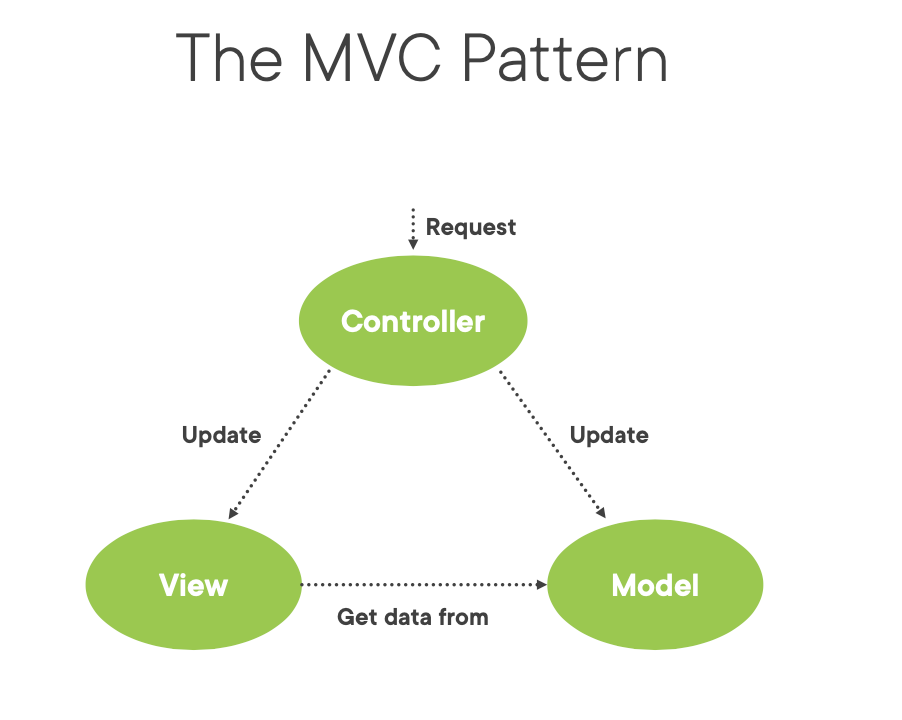
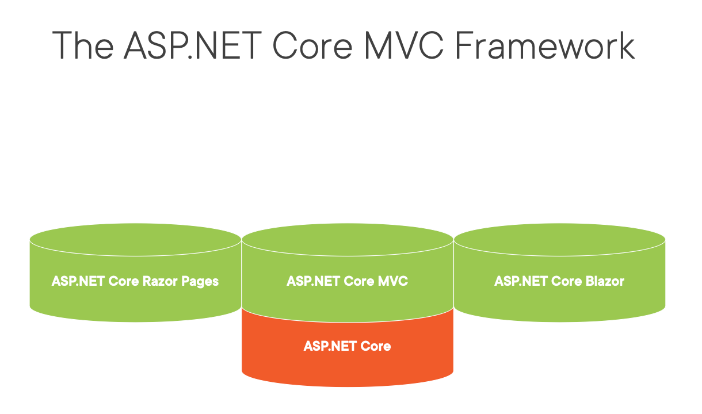

## Introducing the MVC pattern

### Model – View – Controller
- Common design pattern
- Separation of concerns
- Less dependencies
- Promotes testability and maintainability


## MVC



## The ASP.NET Core MVC Framework



# Creating the Model and the Repository

## Convention Based Folders


## The Model

Domain data & logic to manage data 
Simple API
Hides details of managing the data

`Sample Model Class`

```
namespace BethanysPieShop.Models
{
    public class Pie
    {
        public int PieId { get; set; }
        public string Name { get; set; } = string.Empty;
        public string? ShortDescription { get; set; }
        public string? LongDescription { get; set; }
        public string? AllergyInformation { get; set; }
        public decimal Price { get; set; }
        public string? ImageUrl { get; set; }
        public string? ImageThumbnailUrl { get; set; }
        public bool IsPieOfTheWeek { get; set; }
        public bool InStock { get; set; }
        public int CategoryId { get; set; }
        public Category Category { get; set; } = default!;
    }
}

```

```

namespace BethanysPieShop.Models
{
    public class Category
    {
        public int CategoryId { get; set; }
        public string CategoryName { get; set; } = string.Empty;
        public string? Description { get; set; }
        public List<Pie>? Pies { get; set; }
    }
}

```


## Pie Repository 

```

namespace BethanysPieShop.Models
{
    public interface IPieRepository
    {
        IEnumerable<Pie> AllPies { get; }
        IEnumerable<Pie> PiesOfTheWeek { get; }
        Pie? GetPieById(int pieId);
        IEnumerable<Pie> SearchPies(string searchQuery);
    }
}

```

```

namespace BethanysPieShop.Models
{
    public class MockPieRepository : IPieRepository
    {
        private readonly ICategoryRepository _categoryRepository = new MockCategoryRepository();

        public IEnumerable<Pie> AllPies =>
            new List<Pie>
            {
                new Pie {PieId = 1, Name="Strawberry Pie", Price=15.95M, ShortDescription="Lorem Ipsum", LongDescription="Icing carrot cake jelly-o cheesecake. Sweet roll marzipan marshmallow toffee brownie brownie candy tootsie roll. Chocolate cake gingerbread tootsie roll oat cake pie chocolate bar cookie dragée brownie. Lollipop cotton candy cake bear claw oat cake. Dragée candy canes dessert tart. Marzipan dragée gummies lollipop jujubes chocolate bar candy canes. Icing gingerbread chupa chups cotton candy cookie sweet icing bonbon gummies. Gummies lollipop brownie biscuit danish chocolate cake. Danish powder cookie macaroon chocolate donut tart. Carrot cake dragée croissant lemon drops liquorice lemon drops cookie lollipop toffee. Carrot cake carrot cake liquorice sugar plum topping bonbon pie muffin jujubes. Jelly pastry wafer tart caramels bear claw. Tiramisu tart pie cake danish lemon drops. Brownie cupcake dragée gummies.", Category = _categoryRepository.AllCategories.ToList()[0],ImageUrl="https://gillcleerenpluralsight.blob.core.windows.net/files/bethanyspieshop/fruitpies/strawberrypie.jpg", InStock=true, IsPieOfTheWeek=false, ImageThumbnailUrl="https://gillcleerenpluralsight.blob.core.windows.net/files/bethanyspieshop/fruitpies/strawberrypiesmall.jpg"},
                new Pie {PieId = 2, Name="Cheese cake", Price=18.95M, ShortDescription="Lorem Ipsum", LongDescription="Icing carrot cake jelly-o cheesecake. Sweet roll marzipan marshmallow toffee brownie brownie candy tootsie roll. Chocolate cake gingerbread tootsie roll oat cake pie chocolate bar cookie dragée brownie. Lollipop cotton candy cake bear claw oat cake. Dragée candy canes dessert tart. Marzipan dragée gummies lollipop jujubes chocolate bar candy canes. Icing gingerbread chupa chups cotton candy cookie sweet icing bonbon gummies. Gummies lollipop brownie biscuit danish chocolate cake. Danish powder cookie macaroon chocolate donut tart. Carrot cake dragée croissant lemon drops liquorice lemon drops cookie lollipop toffee. Carrot cake carrot cake liquorice sugar plum topping bonbon pie muffin jujubes. Jelly pastry wafer tart caramels bear claw. Tiramisu tart pie cake danish lemon drops. Brownie cupcake dragée gummies.", Category = _categoryRepository.AllCategories.ToList()[1],ImageUrl="https://gillcleerenpluralsight.blob.core.windows.net/files/bethanyspieshop/cheesecakes/cheesecake.jpg", InStock=true, IsPieOfTheWeek=false, ImageThumbnailUrl="https://gillcleerenpluralsight.blob.core.windows.net/files/bethanyspieshop/cheesecakes/cheesecakesmall.jpg"},
                new Pie {PieId = 3, Name="Rhubarb Pie", Price=15.95M, ShortDescription="Lorem Ipsum", LongDescription="Icing carrot cake jelly-o cheesecake. Sweet roll marzipan marshmallow toffee brownie brownie candy tootsie roll. Chocolate cake gingerbread tootsie roll oat cake pie chocolate bar cookie dragée brownie. Lollipop cotton candy cake bear claw oat cake. Dragée candy canes dessert tart. Marzipan dragée gummies lollipop jujubes chocolate bar candy canes. Icing gingerbread chupa chups cotton candy cookie sweet icing bonbon gummies. Gummies lollipop brownie biscuit danish chocolate cake. Danish powder cookie macaroon chocolate donut tart. Carrot cake dragée croissant lemon drops liquorice lemon drops cookie lollipop toffee. Carrot cake carrot cake liquorice sugar plum topping bonbon pie muffin jujubes. Jelly pastry wafer tart caramels bear claw. Tiramisu tart pie cake danish lemon drops. Brownie cupcake dragée gummies.", Category = _categoryRepository.AllCategories.ToList()[0],ImageUrl="https://gillcleerenpluralsight.blob.core.windows.net/files/bethanyspieshop/fruitpies/rhubarbpie.jpg", InStock=true, IsPieOfTheWeek=true, ImageThumbnailUrl="https://gillcleerenpluralsight.blob.core.windows.net/files/bethanyspieshop/fruitpies/rhubarbpiesmall.jpg"},
                new Pie {PieId = 4, Name="Pumpkin Pie", Price=12.95M, ShortDescription="Lorem Ipsum", LongDescription="Icing carrot cake jelly-o cheesecake. Sweet roll marzipan marshmallow toffee brownie brownie candy tootsie roll. Chocolate cake gingerbread tootsie roll oat cake pie chocolate bar cookie dragée brownie. Lollipop cotton candy cake bear claw oat cake. Dragée candy canes dessert tart. Marzipan dragée gummies lollipop jujubes chocolate bar candy canes. Icing gingerbread chupa chups cotton candy cookie sweet icing bonbon gummies. Gummies lollipop brownie biscuit danish chocolate cake. Danish powder cookie macaroon chocolate donut tart. Carrot cake dragée croissant lemon drops liquorice lemon drops cookie lollipop toffee. Carrot cake carrot cake liquorice sugar plum topping bonbon pie muffin jujubes. Jelly pastry wafer tart caramels bear claw. Tiramisu tart pie cake danish lemon drops. Brownie cupcake dragée gummies.", Category = _categoryRepository.AllCategories.ToList()[2],ImageUrl="https://gillcleerenpluralsight.blob.core.windows.net/files/bethanyspieshop/seasonal/pumpkinpie.jpg", InStock=true, IsPieOfTheWeek=true, ImageThumbnailUrl="https://gillcleerenpluralsight.blob.core.windows.net/files/bethanyspieshop/seasonal/pumpkinpiesmall.jpg"}
            };

        public IEnumerable<Pie> PiesOfTheWeek
        {
            get
            {
                return AllPies.Where(p => p.IsPieOfTheWeek);
            }
        }

        public Pie? GetPieById(int pieId) => AllPies.FirstOrDefault(p => p.PieId == pieId);

        public IEnumerable<Pie> SearchPies(string searchQuery)
        {
            throw new NotImplementedException();
        }
    }
}
```

## Category Repository

```
namespace BethanysPieShop.Models
{
    public interface ICategoryRepository
    {
        IEnumerable<Category> AllCategories { get; }
    }
}
```

```
namespace BethanysPieShop.Models
{
    public class MockCategoryRepository : ICategoryRepository
    {
        public IEnumerable<Category> AllCategories =>
            new List<Category>
            {
                new Category{CategoryId=1, CategoryName="Fruit pies", Description="All-fruity pies"},
                new Category{CategoryId=2, CategoryName="Cheese cakes", Description="Cheesy all the way"},
                new Category{CategoryId=3, CategoryName="Seasonal pies", Description="Get in the mood for a seasonal pie"}
            };
    }
}
```

## Registering the Repository

Within `Program.cs`

```
var builder = WebApplication.CreateBuilder(args);

// Add services to the container.
builder.Services.AddControllersWithViews();
builder.Services.AddScoped<IPieRepository, MockPieRepository>();

```

## Creating the Controller

```

using System;
using System.Collections.Generic;
using System.Linq;
using System.Threading.Tasks;
using Microsoft.AspNetCore.Mvc;

namespace BethanysPieShop.Controllers
{
    public class PieController : Controller
    {
        public IActionResult Index() ## action
        {
            return View(); ## View
        }
    }
}

```

Inject Services

```

using BethanysPieShop.Models;
using BethanysPieShop.ViewModels;
using Microsoft.AspNetCore.Mvc;

namespace BethanysPieShop.Controllers
{
    public class PieController : Controller
    {
        private readonly IPieRepository _pieRepository;
        private readonly ICategoryRepository _categoryRepository;

        public PieController(IPieRepository pieRepository, ICategoryRepository categoryRepository)
        {
            _pieRepository = pieRepository;
            _categoryRepository = categoryRepository;
        }

        public IActionResult List()
        {
            ViewBag.CurrentCategory = "Cheese cakes";

            return View(_pieRepository.AllPies);
        }
    }
}
```

## Adding View

The project structure for our application is organized as follows:

- ...
- Controllers
- Views
  - Home
  - Shared
- ...

You need to Make new folder within Views 

- ...
- Controllers
- Views
  - Home
  - Shared
  - Pie
- ...
      
```
using Microsoft.AspNetCore.Mvc;

namespace BethanysPieShop.Controllers
{
    public class PieController : Controller
    {
        public IActionResult Index()
        {
            return View();
        }
    }
}

``` 

Code Above Shown is used to sho Index.cshtml within Pie Folder of View You can try with this 


```

<!DOCTYPE html>
<html>
<head>
    <title>Index</title>
</head>
<body>
    <div>
        Welcome to Bethany’s Pie Shop 
    </div>
</body>
</html>

```

Now We are more interested to show Pies Rather Than Simple Index


Now Here is code that will show all Pies

```

@model IEnumerable<Pie>
<html>
<body>
    <div>
        @foreach (var pie in Model)
        {
            <div>
                <h2>@pie.Name</h2>
                <h3>@pie.Price.ToString("c")</h3>
                <h4>@pie.Category.CategoryName</h4>
            </div>      }
    </div>
</body>
A Strongly-typed View
</html>

```
