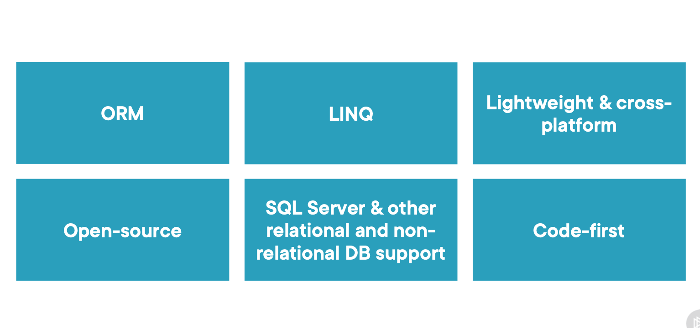

# Working with Real Data Using Entity Framework Core 6

Introducing Entity Framework Core 6




## Using EF Core
- Speed of development
- Can work with SQL statements
- But... can sometimes be less performant than raw SQL

## Adding EF Core to the Application with postgres database

1. Install the Npgsql Entity Framework Core provider. This allows Entity Framework Core to connect to a PostgreSQL database. Open a terminal in your project directory and run:

```
dotnet add package Npgsql.EntityFrameworkCore.PostgreSQL

dotnet add package Microsoft.EntityFrameworkCore.Tools

```

2. Add a connection string for your PostgreSQL database to your appsettings.json file. Replace "YourDatabase", "YourUsername", and "YourPassword" with your specific PostgreSQL credentials:

```

{
  "ConnectionStrings": {
    "DefaultConnection": "Host=localhost;Database=YourDatabase;Username=YourUsername;Password=YourPassword"
  },
  ...
}
```

In our Context 

```
"ConnectionStrings": {
    "BethanysPieShopDbContextConnection": "Host=localhost;Database=BethanysPieShop8854;Username=postgres;Password=YourStrong@Passw0rd"
  }

```

You can alternatively run docker compose file within repo with command to start db with above config

```

docker compose up -d

```

3. Create a new DbContext class (or modify an existing one). This class will define your database schema:

### DbContext Definition
- Inherits from EF Core's `DbContext`.
- Utilizes `DbContextOptions<BethanysPieShopDbContext>` to receive configuration options.

### DbSet Properties
- `DbSet<Category>`: Represents the `Categories` table in the database.
- `DbSet<Pie>`: Represents the `Pies` table in the database.

### Model Configuration in OnModelCreating Method
- Iterates over all entity types, specifically targeting string properties.
- Sets the column type of all string properties to `text` (can be adjusted to `varchar` as needed) to ensure consistency and optimize database interactions.

### Purpose and Benefits
- Ensures consistency across all string columns in the database schema.
- Facilitates database schema maintenance and application scalability.
- Aligns the .NET data model with the underlying database, enhancing data management and access efficiency.

## Usage in Application
This DbContext is central to the application's data layer, interfacing with the database for CRUD operations on `Categories` and `Pies`. It must be configured in the application's startup class and can then be injected into repositories or services that require data access.


```
using Microsoft.EntityFrameworkCore;

namespace BethanysPieShop.Models
{
    public class BethanysPieShopDbContext: DbContext
    {
        public BethanysPieShopDbContext(DbContextOptions<BethanysPieShopDbContext> options) : base(options)
        {

        }

        public DbSet<Category> Categories { get; set; }
        public DbSet<Pie> Pies { get; set; }


        protected override void OnModelCreating(ModelBuilder modelBuilder)
        {
            base.OnModelCreating(modelBuilder);

            foreach (var property in modelBuilder.Model.GetEntityTypes()
                .SelectMany(t => t.GetProperties())
                .Where(p => p.ClrType == typeof(string)))
            {
                property.SetColumnType("text");  // or "varchar"
            }

            // Other model configurations...
        }
    }

    

}

```
4. Modify the ConfigureServices method in your Program.cs file to add and configure the PostgreSQL service:

```

builder.Services.AddDbContext<BethanysPieShopDbContext>(options => {
    options.UseNpgsql(
        builder.Configuration["ConnectionStrings:BethanysPieShopDbContextConnection"]);
});

```

5. Generate your database migration:

```
dotnet ef migrations add InitialCreate

```

6. After generating your migration, update your database:

```
dotnet ef database update

```

7. I have added Seed Data Along With This You will get this file on DbInitalize

You need to configure this on Startup.cs/Program.cs
```
.....
DbInitializer.Seed(app);

````


