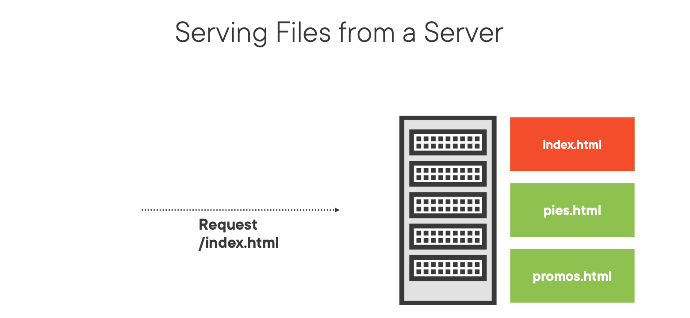
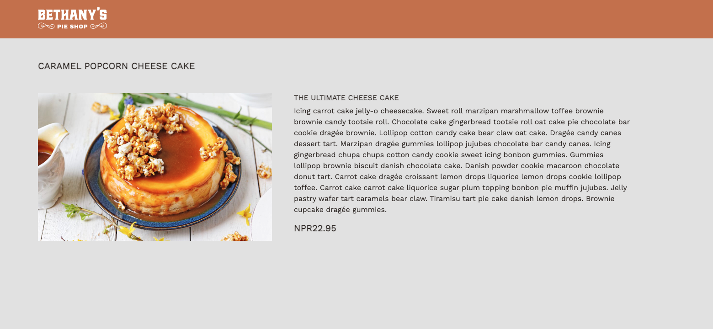

# Routing in ASP.NET Core and ASP.NET Core MVC

## Introduction
Routing in ASP.NET Core is the mechanism used to map incoming requests to the appropriate handlers. It is a crucial component of any ASP.NET Core application. This document explains the key concepts and provides basic examples to help you get started.



# Components of Routing

## Routes
A route is a URL pattern that is mapped to a handler. The handler can be a Razor page, an action method, etc. Routes can extract values from the URL contained in the request, which can then be used to process the request.

## Route Template
A route template is a string composed of literals and placeholders (aka variables). Placeholders are enclosed in curly braces { }.

Example: "blog/{year}/{month}/{day}".

## Route Values
Values extracted from the URL. In the example above, year, month, and day are route values.

## Route Constraints
Specify restrictions on the values of placeholders.

Example: "blog/{year:minlength(4)}".

## Route Data
Data that is associated with a route, usually derived from route values and defaults.

## Route Handler
The code that executes when a route matches. This can be a Razor Page, MVC action, etc.

## Configuring Routing
Routing configuration in ASP.NET Core is typically done in the Startup.cs file's Configure method.

1. Default Route:

```
app.UseEndpoints(endpoints =>
    {
        endpoints.MapControllerRoute(
            name: "default",
            pattern: "{controller=Home}/{action=Index}/{id?}");
    });
``` 

In this pattern, controller, action, and id are placeholders that get replaced by the controller name, action method name, and optional identifier, respectively. The equals sign (=) sets a default value, while the question mark (?) denotes that the id parameter is optional.

2. Named Route:
You can give a name to your route and set a unique pattern:

```

endpoints.MapControllerRoute(
    name: "product_detail",
    pattern: "product/{id}",
    defaults: new { controller = "Product", action = "Detail" });

```

3. Attribute Routing:
You can apply route configurations directly to controllers and actions using attributes:

```
[Route("api/[controller]")]
public class ProductsController : Controller
{
    [HttpGet("{id}")]
    public IActionResult GetProduct(int id)
    {
        //...
    }
}
``` 

4. Route Constraints:
You can add constraints to control the matching behavior of your routes:

```
endpoints.MapControllerRoute(
    name: "product_detail",
    pattern: "product/{id:int}");
```
In this example, the :int constraint ensures that this route will only be selected if the id segment of the URL is an integer.

Multiple Routes in Startup.cs

You can define multiple routes in the Configure method of the Startup.cs file. The order matters because the framework stops at the first match:

```
app.UseEndpoints(endpoints =>
{
    endpoints.MapControllerRoute(
        name: "product_detail",
        pattern: "product/{id}",
        defaults: new { controller = "Product", action = "Detail" });

    endpoints.MapControllerRoute(
        name: "user_profile",
        pattern: "user/{username}",
        defaults: new { controller = "User", action = "Profile" });

    // The default route should be last
    endpoints.MapControllerRoute(
        name: "default",
        pattern: "{controller=Home}/{action=Index}/{id?}");
});

```

# Tag Helpers

ASP.NET Core Tag Helpers enable server-side code to participate in creating and rendering HTML elements in Razor files. Tag Helpers are one of the key features of ASP.NET Core MVC, allowing for a cleaner syntax for including server-side functionality in your views, compared to using traditional HTML Helpers.

## Components of Tag Helpers

## Tag Helper
A Tag Helper represents a server-side Razor component. They're C# classes that either target specific HTML tags in Razor views, or target elements based on the element name and its attributes.

## Process
When a Razor view with a Tag Helper is rendered, the Tag Helper's output replaces the targeted HTML. This process enables the creation of dynamic HTML content.

## Built-in Tag Helpers
ASP.NET Core includes several built-in Tag Helpers. They're located in the Microsoft.AspNetCore.Mvc.TagHelpers namespace, and can be used directly in your views.

Here are some examples of built-in Tag Helpers:

1. Link Tag Helper - Enhances the link tag to support new attributes for managing static resources.

2. Script Tag Helper - Enhances the script tag for the same reasons as the Link Tag Helper.

3. Environment Tag Helper - Helps conditionally rendering content based on the hosting environment.

4. Form Tag Helpers - Enhances form elements and form submission.

5. Image Tag Helper - Enhances the img tag to provide server-side attributes for responsive images.


## Using Tag Helpers
To use Tag Helpers in your views, you need to add the following line to your 
`_ViewImports.cshtml:`

```
@addTagHelper *, Microsoft.AspNetCore.Mvc.TagHelpers

```

After Importing you can use tag helper on all razor pages


We will write different tag helper for our context/our application

We will show individual Pie and its description with help of tag helper

Add Following Code on Pie Controller and it can detect Pie/Details/1 where `Pie is controller Details is Action and 1 is id`

```
public IActionResult Details(int id)
        {
            var pie = _pieRepository.GetPieById(id);
            if (pie == null)
                return NotFound();

            return View(pie);
        }
```        

Now We have Action Registered on Controller, We need to have view to show Individual Pie ie `Details.cshtml`

```
@model Pie

<h3 class="my-5">
    @Model.Name
</h3>

<div class="row gx-5">
    
    <div class="col-7">
        <h4>@Model.ShortDescription</h4>
        <p>@Model.LongDescription</p>
        <h3 class="pull-right">@Model.Price.ToString("c")</h3>
        <div class="addToCart">
            <p class="button">
               
            </p>
        </div>
    </div>
</div>
```

The @model Pie statement at the top of the view declares the model for the Razor view. This specifies that the model for this view is of type Pie. The Pie is a C# class (model) which likely has properties like Name, ImageUrl, ShortDescription, LongDescription, and Price

Now if you open route something similiar below

```
https://localhost:7147/Pie/Details/1

```



It would be difficult for user to come on website by directly writing endpoint We can use tag helper on `List` route and dynamically come to `pie detail page`

Use of Controller Tag Helper

`List.cshtml`

```
.....

<h2 class="text-start">
                            <a asp-controller="Pie"
                               asp-action="Details"
                               asp-route-id="@pie.PieId"
                               class="pie-link">@pie.Name</a>
                        </h2>

                        .......

```
Different Tag Helper Used her 

`asp-controller`: This is a Tag Helper attribute, which is used to specify the controller in an MVC application that should handle this request. The controller's name is specified without the "Controller" part of the class name.

`asp-action`: This is another Tag Helper attribute. It specifies the action method on the controller that should be invoked when this link is clicked.

`asp-route-id`: This Tag Helper attribute is used to pass route data to the controller action. The value passed here (in this case, @pie.PieId) will be used by the routing system to match parameters in the route template.

When rendered to HTML, it might look something like this:

```
<a href="/Pie/Details/1" class="pie-link">Apple Pie</a>

```


