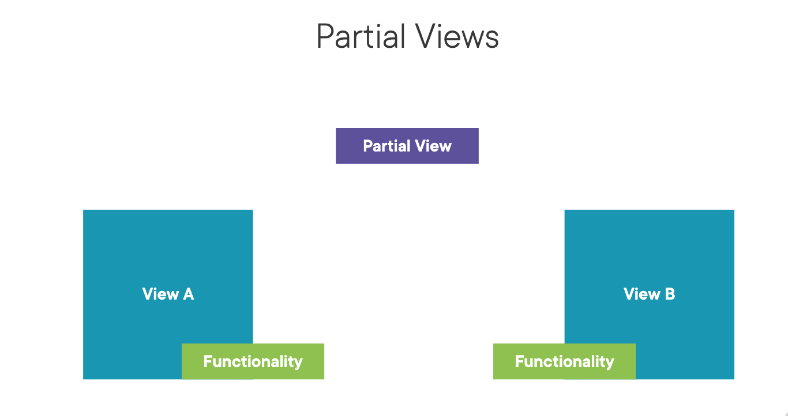

# Partial View

## Introduction
A Partial View is like as user control in ASP.NET Web Forms. It represents reusable snippets of HTML that can be referenced in multiple locations, which means we can define it once, and then use it in multiple places.




## When to use Partial Views?
Partial views are ideal when you have reusable components in your web application. Examples of this could be a navigation bar, footer, or a user's profile preview. If these components are used in multiple locations, it would be better to have a single definition for these components that can be reused.

## How to create a Partial View
1. In the Views folder, create a new folder named Shared. If it doesn't already exist.
2. Right-click on the Shared folder, select Add, then New Item.
3. From the new item dialog box, select RazorPage and then give your partial view a name.
Remember, it is convention to start partial view names with an underscore (_), though this is not mandatory. For example, _NavigationView.cshtml.


In our context, We will create _PieCard.cshtml

```


@model Pie
<div class="col">
    <div class="card pie-card">
        
        <div class="card-body pie-button">
            <h4 class="d-grid">
                <a class="btn btn-secondary" 
                   asp-controller="ShoppingCart" 
                   asp-action="AddToShoppingCart"
                   asp-route-pieId="@Model.PieId"> + Add to cart</a>
            </h4>
            
            <div class="d-flex justify-content-between mt-2">
                <h2 class="text-start">
                    <a asp-controller="Pie"
                       asp-action="Details"
                       asp-route-id="@Model.PieId"
                       class="pie-link">@Model.Name</a>
                </h2>
                <h5 class="text-nowrap">
                    @Model.Price.ToString("c")
                </h5>
            </div>
        </div>
    </div>
</div>

```

Within Project, Details.cshtml 

```
<partial name="_PieCard" model="pie" />

```


 


