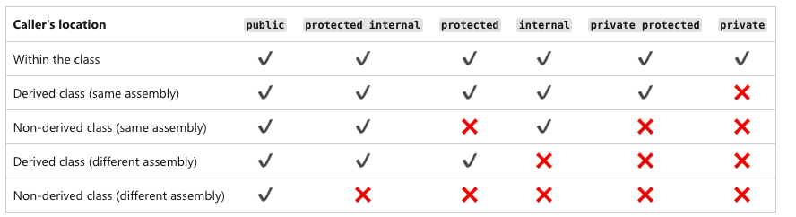

# Access Modifiers In C#

 Access modifiers in C# are used to specify the scope of accessibility of a member of a class or type of the class itself. For example, a public class is accessible to everyone without any restrictions, while an internal class may be accessible to the assembly only.

 ## Why to use access modifiers?
   
  Access modifiers are an integral part of object-oriented programming. Access modifiers are used to implement encapsulation of OOP. Access modifiers allow you to define who does or who doesn't have access to certain features.

Access Modifier folder have all the program within our scope. However there is so much of things to learn a part of scope. You can learn from below official Reference Shared.

   
 

[More on Access Modifier from Official Docs](https://learn.microsoft.com/en-us/dotnet/csharp/programming-guide/classes-and-structs/access-modifiers)